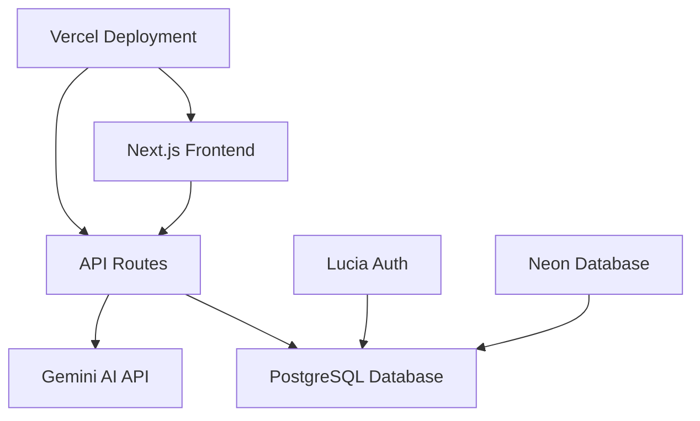

<h1 align="center">
  <br>
  <a href="#"></a>
  <br>
  Prompter AI
  <br>
</h1>

<h4 align="center">An AI-powered productivity co-pilot that transforms natural language into actionable tasks with intelligent scheduling, calendar integration, and seamless task management.</h4>

<p align="center">
  <a href="#">
    
  </a>
  <a href="#">
    
  </a>
  <a href="#">
    
  </a>
  <a href="#">
    
  </a>
  <a href="#">
    
  </a>
  <br>
  <a href="#">
    
  </a>
  <a href="#">
    
  </a>
  <a href="#">
    
  </a>
  <a href="https://to-do-ai.vercel.app">
    
  </a>
</p>

<p align="center">
  <a href="#key-features">Key Features</a> •
  <a href="#tech-stack">Tech Stack</a> •
  <a href="#installation">Installation</a> •
  <a href="#usage">Usage</a> •
  <a href="#api-integration">API</a> •
  <a href="#deployment">Deployment</a> •
  <a href="#contributing">Contributing</a>
</p>

<p align="center">
  


</p>

## 🚀 Key Features

### 🤖 **AI-Powered Task Generation**
- **Natural Language Processing**: Convert everyday language into structured tasks
- **Intelligent Suggestions**: AI analyzes context to suggest relevant tasks
- **Smart Scheduling**: Automatic time estimation and calendar integration
- **Context Awareness**: Learns from user patterns and preferences

### 📅 **Advanced Calendar Management**
- **Multiple View Modes**: Weekly, monthly, and daily calendar views
- **Drag & Drop Interface**: Intuitive task scheduling and rescheduling
- **Overflow Handling**: "Show more" functionality for busy calendar cells
- **Real-time Sync**: Instant updates across all devices and views

### 🎨 **Modern User Experience**
- **Responsive Design**: Seamless experience across desktop, tablet, and mobile
- **Dark Mode Support**: Eye-friendly interface with theme switching
- **Clean UI/UX**: Minimalist design focused on productivity
- **Fast Performance**: Optimized loading and smooth interactions

### 🔐 **Enterprise-Grade Security**
- **Lucia Auth Integration**: Secure authentication system
- **Session Management**: Persistent, secure user sessions
- **Data Protection**: Encrypted data storage and transmission
- **Privacy First**: User data stays private and secure

## 🛠️ Technical Stack

| Layer | Technology | Version | Purpose |
|-------|------------|---------|---------|
| **Frontend** | Next.js | 14+ | Full-stack React framework with App Router |
| **Language** | TypeScript | 5.0+ | Type-safe development and better DX |
| **Styling** | Tailwind CSS | 3.0+ | Utility-first CSS framework |
| **Database** | PostgreSQL | 15+ | Robust relational database |
| **ORM** | Drizzle ORM | Latest | Type-safe database operations |
| **Authentication** | Lucia Auth | Latest | Secure session-based authentication |
| **AI Integration** | Gemini AI API | Latest | Natural language to task conversion |
| **Deployment** | Vercel | Latest | Serverless deployment platform |
| **Database Host** | Neon | Latest | Serverless PostgreSQL hosting |

### **Technology Justification**

- **Next.js 14**: Chosen for its App Router, server components, and excellent developer experience
- **TypeScript**: Essential for type safety in complex AI integrations and database operations
- **Tailwind CSS**: Provides rapid UI development with consistent design system
- **Drizzle ORM**: Offers type-safe database queries and excellent TypeScript support
- **Lucia Auth**: Lightweight, secure authentication with session management
- **Gemini AI**: Advanced language model for natural language processing
- **Vercel + Neon**: Seamless full-stack deployment with serverless architecture


## 🏛️ Architecture



## 📦 Installation

### Prerequisites
- Node.js 18+
- pnpm or npm
- PostgreSQL database (or Neon account)
- Gemini AI API key

### Quick Start

```bash
# Clone the repository
git clone https://github.com/Mithurn/to-do-ai.git
cd to-do-ai

# Install dependencies
pnpm install

# Set up environment variables
cp .env.example .env
# Edit .env with your configuration

# Run database migrations
pnpm db:push

# Start development server
pnpm dev
```

### Environment Setup

Create a `.env` file in the root directory with the following variables:

```bash
# Database Configuration
DATABASE_URL=your_neon_postgres_url

# AI Integration
OPENAI_API_KEY=your_openai_api_key

# Application Configuration
NEXT_PUBLIC_APP_URL=http://localhost:3000

# Authentication
AUTH_SECRET=your-auth-secret-key
```

**Note**: See `env.example` for additional configuration options.

## 🎯 Usage

### Getting Started

1. **Sign Up/Login**: Create an account or sign in with existing credentials
2. **AI Task Creation**: Type natural language like "Schedule a meeting with the team tomorrow at 2 PM"
3. **Calendar Management**: View and manage tasks in weekly or monthly calendar views
4. **Task Organization**: Use the dashboard to see all upcoming tasks and priorities

### AI Features

- **Natural Language Input**: "Remind me to call mom this weekend"
- **Smart Scheduling**: AI suggests optimal times based on your calendar
- **Context Awareness**: Learns from your task patterns and preferences
- **Priority Detection**: Automatically categorizes urgent vs. normal tasks

### Calendar Features

- **Multiple Views**: Switch between daily, weekly, and monthly views
- **Drag & Drop**: Easily reschedule tasks by dragging them
- **Overflow Handling**: Click "Show more" when calendar cells are full
- **Real-time Updates**: Changes sync instantly across all views

## 🐳 Deployment

### Vercel Deployment

```bash
# Install Vercel CLI
npm i -g vercel

# Deploy to Vercel
vercel

# Set environment variables in Vercel dashboard
# DATABASE_URL, OPENAI_API_KEY, etc.
```

### Environment Variables for Production

```bash
DATABASE_URL=your_production_neon_url
OPENAI_API_KEY=your_production_openai_key
NEXT_PUBLIC_APP_URL=https://your-domain.vercel.app
AUTH_SECRET=your-production-auth-secret
```

## 🤝 Contributing

Contributions are welcome! Please feel free to submit a Pull Request.

### Development Setup

```bash
# Install dependencies
pnpm install

# Set up environment
cp .env.example .env

# Run database migrations
pnpm db:push

# Start development server
pnpm dev

# Run tests
pnpm test
```

## ⚖️ Privacy & Security

This application is built with privacy and security as core principles:

- ✅ **Data Encryption**: All data is encrypted in transit and at rest
- ✅ **No Data Mining**: Your personal data is never used for training AI models
- ✅ **Secure Authentication**: Industry-standard authentication practices
- ✅ **GDPR Compliant**: Full compliance with data protection regulations

## 📄 License

This project is licensed under the MIT License - see the [LICENSE](LICENSE) file for details.

## 👨‍💻 Author & Contact

**Mithurn Jeromme**  
*Full-Stack Developer & AI Enthusiast*

- 🌐 **Website**: [mithurnjeromme.vercel.app](https://mithurnjeromme.vercel.app)
- 💼 **LinkedIn**: [linkedin.com/in/mithurn-jeromme-s-k](https://www.linkedin.com/in/mithurn-jeromme-s-k/)
- 🐙 **GitHub**: [github.com/Mithurn](https://github.com/Mithurn)
- 📧 **Email**: mithurnjeromme172@gmail.com
- 🐦 **Twitter**: [@Mithurn_Jeromme](https://x.com/Mithurn_Jeromme)

---

<div align="center">

**Built with ❤️ by Mithurn Jeromme**

[Report Bug](https://github.com/Mithurn/to-do-ai/issues) • [Request Feature](https://github.com/Mithurn/to-do-ai/issues) • [Documentation](https://github.com/Mithurn/to-do-ai/wiki)

</div>
